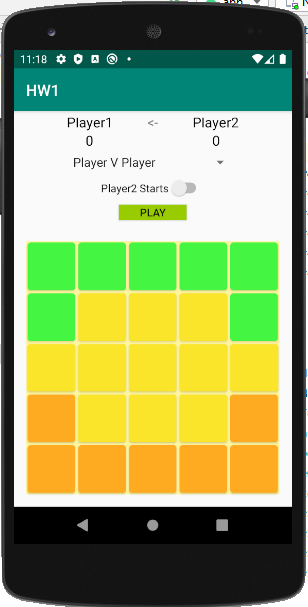
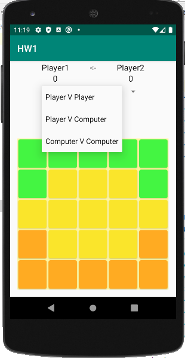
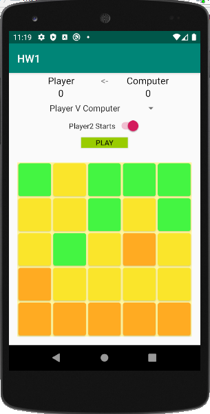

# Five Field Kono

## What is it?
"Five Field Kono(오밭고누) is a Korean abstract strategy game. As in Chinese checkers, a player wins by moving all of their pieces into the starting locations of their opponent's pieces." (Wiki: https://en.wikipedia.org/wiki/Five_Field_Kono)

## How to play?
In Android Studio: Compile and Run the application with android device w/sdk 18+

## Languages & Techonologies: 
Android, Kotlin, XML

## Screenshots

| Overview     | Different game modes available      |  Game against computer     |  
|------------|-------------|-------------|
|  | | | 